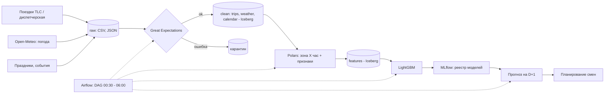

# Big Data 5V Playbook

> Практическое руководство для анализа Big Data-сценариев по методологии 5V, выбора технологий и оценки бизнес-ценности.

[](https://www.python.org/)
[](https://jupyter.org/)

Проект является исполнением учебного задания. Включает раннюю стадию проектирования BigData-решений.

## Цель работы:
Научиться:
1. Анализировать реальные данные по критериям 5V (Volume, Velocity, Variety, Veracity, Value)
2. Оценивать пригодность данных для решения бизнес-задач
3. Выбирать технологии под конкретные требования
4. Рассчитывать потенциальную бизнес-ценность решения

В репозитории содержится методология, шаблоны, ноутбук и чеклист выбора технологий.

**Данные:** [NYC Yellow Taxi Trip Data](https://www.kaggle.com/datasets/elemento/nyc-yellow-taxi-trip-data). 4 месяца поездок жёлтого такси Нью-Йорка (2015-01, 2016-01...03), 47 млн записей, 7.4 ГБ CSV.
**Бизнес-сценарий:** прогнозирование спроса. Почасовой прогноз поездок по районам к 06:00, чтобы сократить холостые машино-часы парка на 25%.

## Зачем это?

Многие BigData-проекты проваливаются из-за неясных требований. Этот playbook отображает повторяемый способ:
- оценить датасет по 5V;
- выбрать между batch, micro-batch и streaming;
- рассчитать хранение, вычисления и ROI;
- обосновать стек технологий конкретными цифрами.

## Что внутри?

- Jupyter Notebook c 5V-анализом;
- Чеклисты по Volume, Velocity, Variety, Veracity, Value;
- Матрица выбора технологий;
- Примеры расчета ROI;
- Mermaid-пример архитектуры.

## 5V кратко

| V | Вопрос | Артефакт |
|---|---|---|
| Volume | Сколько данных? | Расчёт объёма, форматы, стоимость хранения |
| Velocity | Как быстро приходят? | Batch / micro-batch / streaming. Выбор технологий |
| Variety | Какие данные? | Структура, разнообразие, неструктурированные данные |
| Veracity | Можно ли доверять? | Качество, аномалии, Great Expectations |
| Value | Зачем это бизнесу? | ROI, метрики, приоритизация |

## Быстрый старт

Нужен [uv](https://docs.astral.sh/uv/). Python 3.13 он поставит сам.

```bash
uv sync                                   # окружение из uv.lock
uv run --with jupyterlab jupyter lab      # или открыть ноутбук в PyCharm с интерпретатором .venv
```

Данные в репозиторий не входят. При первом запуске ноутбук скачивает их через `kagglehub` в `data/` (\~1.8 ГБ архива, \~8 ГБ после распаковки и конвертации) и создаёт Parquet-копию. Полный прогон ноутбука после загрузки данных занимает \~2 минуты на Apple M4 / 16 ГБ.

Без uv: `pip install -r requirements.txt` (Python 3.13).

## Структура

```
├── notebooks/
│   └── 5v.ipynb            # анализ: введение, части 1-6, заключение
├── data/                   # сырые CSV, Parquet, агрегаты
└── pyproject.toml          # зависимости
```

## Ход работы и ключевые результаты

| Часть | Статус | Главный вывод                                                                                                                                                                                      |
|---|--------|----------------------------------------------------------------------------------------------------------------------------------------------------------------------------------------------------|
| 1. Volume | done | Parquet+zstd сжимает в x7 и ускоряет запросы в десятки раз. Год поездок \~3.3 ГБ, хранение \~25 ₽ за первый год. Volume не критичен, Spark понадобится только при подключении GPS-телеметрии (1 ТБ через \~21 мес.) |
| 2. Velocity | done | \~4.5 поездки/с, пик x2.1. Окно до 06:00 = 6 ч, поэтому batch раз в сутки. Обработка суток данных занимает миллисекунды, Kafka и Flink не нужны |
| 3. Variety | done | 19 структурированных полей, неструктурированных 0 %. Проблемы: дрейф схемы, смена координат на зоны TLC, внешние источники (погода, праздники) |
| 4. Veracity | done | 1.6 % нулевых координат, систематически у вендора 1. Проверки Great Expectations и карантин в пайплайне |
| 5. Value | done | 1.4 % ячеек дают 80 % спроса. ROI за 2 года от 1.5 до 11.4, окупаемость 7-10.5 месяцев |
| 6. Технологии | done | Object Storage + Iceberg, Polars, Great Expectations, LightGBM + MLflow, Airflow. Spark и Kafka - только с GPS-телеметрией |

## Архитектура



